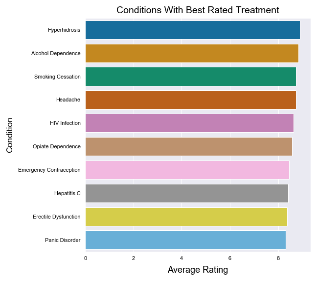
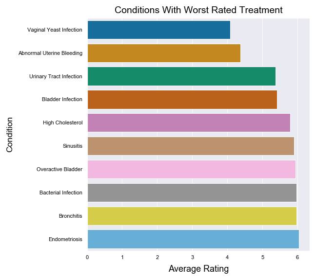

# NLP_NN

# ** Readme to be updated soon **

# Predicting Drug Ratings Based On Reviews
This project aims to predict the rating of a review on a drug, based on the text in the review.
The data comes from online pharmaceutical review sites and contains information such as the review and rating of the drug, and condition it was used for. The data can be found in the following link: http://archive.ics.uci.edu/ml/datasets/Drug+Review+Dataset+%28Drugs.com%29

This project was an opportunity to delve into natural language processing by building a multi-class classifier that uses English text as the input.

 

- [Project Goal](#ProjGoal)
- [Cleaning Data](#Preprocessing)
- [EDA](#EDA)
- [The Model](#Model)
- [Potential Improvements](#Improvements)

 

## Project Goal 
The goal of this project is to predict the rating of a drug review based on the text.
 
 
## Preprocessing/Data Cleaning 
Cleaning text data is slightly different from cleaning typical numerical data. The inputs are strings that we want to extract information from. For this set of data, I used nltk's TweetTokenizer to tokenize the data. The benefit of using TweetTokenizer as opposed to nltk's word_tokenize is that the former doesn't split words by apostrophes so a word like "didn't" stays as "didn't" instead of becoming two words "did" and "n't". Now that the data is tokenized, the stop words and punctuation can then be removed. The words were then lemmatized according to their parts of speech to reduce dimensionality and also because I saw no loss of meaning from considering words like "jump" and "jumping" the same, at least here. Finally, I used keras' Tokenizer to transform the data into a matrix of tf-idf values of each word.
 
 
## Exploratory Data Analysis 
It's important to look at the data to get a good understanding of it for any dataset, and this is no different. One piece of information that might be interesting is what are the conditions whose drugs have the best and worst rating? To find this out, I calculated the average of the ratings for each condition that occurred at least 500 times, so that the drugs can be fairly represented and so that drugs with only one 1/10 review don't skew the numbers improperly by dropping that drug to the bottom. By doing this, I created the following charts:
   
</img>
##
 
</img>
 
From this, we can see that drugs for conditions related to the urinary tract are generally bad.

One other very important piece of information is the distribution of the classes that are going to be predicted. From the chart below, we can see that most of the ratings are concentrated at the far ends of being 1/10 or 10/10. This may tell us that looking at the extremes is a good representation of the overall data:
</img>
 
By looking at the words used in a 1/10 review: 
 
</img>
 
and the words in a 10/10 review: 
 
</img>
 
We can see that the words, when taken individually, are almost the same. Even the proportions among the sizes of the words, which describe their frequency, is about the same. This tells us that there is barely any difference in the words used throughout the reviews.

## The Model 

 
 

## Potential Improvements 
Although this project focused on using NLP techniques, we can always incorporate the rest of the information provided in the dataset to improve the model, such as creating dummy variables for each condition.
